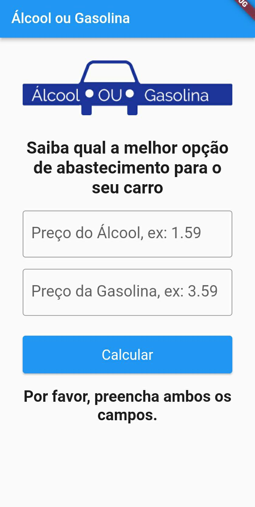

# Álcool ou Gasolina


### 🚗 Escolha o combustível mais econômico para o seu veículo!

Álcool ou Gasolina é um aplicativo desenvolvido em Flutter para fins de estudos que ajuda você a decidir qual combustível é mais econômico para abastecer o seu carro. Com base nos preços informados, o aplicativo informa qual dos dois combustíveis é a melhor opção.

## 📋 Tabela de Conteúdos

- [Funcionalidades](#funcionalidades)
- [Capturas de Tela](#capturas-de-tela)
- [Requisitos](#requisitos)
- [Instalação](#instalação)
- [Como Usar](#como-usar)

## 📜 Funcionalidades

- **Entrada de Preço**: Insira os preços do álcool e da gasolina.
- **Cálculo Automático**: O aplicativo calcula automaticamente qual combustível é mais econômico.
- **Interface Amigável**: Design simples e intuitivo para facilitar o uso.

## 📸 Capturas de Tela



## 🔧 Requisitos

- **Flutter SDK**: Certifique-se de ter a versão mais recente instalada. [Baixe o Flutter SDK aqui](https://flutter.dev/docs/get-started/install).
- **Dart SDK**: Necessário para rodar e compilar o aplicativo Flutter. [Baixe o Dart SDK aqui](https://dart.dev/get-dart).

## 🚀 Instalação

Para rodar o aplicativo em seu ambiente local, siga os passos abaixo:

1. **Clone este repositório**

   ```bash
   git clone https://github.com/PedroC0de/CalculadoraCombustivel.git
   cd CalculadoraCombustivel
   ```

2. **Instale as dependências**

   ```bash
   flutter pub get
   ```

3. **Execute o aplicativo**

   ```bash
   flutter run
   ```

   > **Nota:** Certifique-se de ter um dispositivo emulador configurado ou um dispositivo físico conectado ao seu computador.

## 🧑‍🏫 Como Usar

1. **Abra o aplicativo** no seu dispositivo móvel.
2. **Insira o preço do álcool** no campo correspondente.
3. **Insira o preço da gasolina** no campo correspondente.
4. **Clique no botão "Calcular"** para ver qual combustível é mais econômico.
5. **Veja o resultado**, que indicará a melhor escolha de combustível para o seu veículo.

---

# Alcohol or Gasoline


### 🚗 Choose the most economical fuel for your vehicle!

Alcohol or Gasoline is a Flutter application developed for study purposes that helps you decide which fuel is more economical for your car. Based on the provided prices, the app informs you which of the two fuels is the better option.

## 📋 Table of Contents

- [Features](#features)
- [Screenshots](#screenshots)
- [Requirements](#requirements)
- [Installation](#installation)
- [How to Use](#how-to-use)

## 📜 Features

- **Price Input**: Enter the prices of alcohol and gasoline.
- **Automatic Calculation**: The app automatically calculates which fuel is more economical.
- **User-Friendly Interface**: Simple and intuitive design for easy use.

## 📸 Screenshots


## 🔧 Requirements

- **Flutter SDK**: Ensure you have the latest version installed. [Download Flutter SDK here](https://flutter.dev/docs/get-started/install).
- **Dart SDK**: Necessary for running and compiling the Flutter app. [Download Dart SDK here](https://dart.dev/get-dart).

## 🚀 Installation

To run the application in your local environment, follow the steps below:

1. **Clone this repository**

   ```bash
   git clone https://github.com/PedroC0de/CalculadoraCombustivel.git
   cd CalculadoraCombustivel
   ```

2. **Install dependencies**

   ```bash
   flutter pub get
   ```

3. **Run the app**

   ```bash
   flutter run
   ```

   > **Note:** Make sure you have an emulator device set up or a physical device connected to your computer.

## 🧑‍🏫 How to Use

1. **Open the app** on your mobile device.
2. **Enter the price of alcohol** in the corresponding field.
3. **Enter the price of gasoline** in the corresponding field.
4. **Click the "Calcular" button** to see which fuel is more economical.
5. **View the result**, indicating the best fuel choice for your vehicle.
